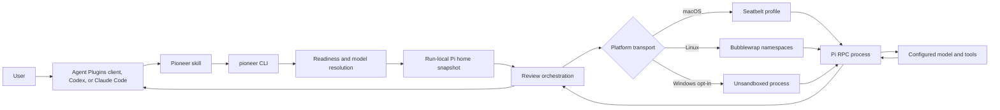

# Architecture

## Purpose and current scope

Pioneer is a local task-delegation bridge from coding agents to the operator's installed Pi coding agent. It currently supports code reviews and isolated skill-eval runs. It reuses Pi's configured providers, authentication, models, and review skills while placing the Pi process behind an operating-system boundary on macOS and Linux. Review execution uses an allowlist of Pi's built-in inspection tools and does not discover optional extensions.

The current product surface is:

- a synchronous review CLI and TypeScript API;
- a fail-closed skill-eval preparation and execution CLI;
- native macOS Seatbelt and Linux Bubblewrap transports;
- one shared Agent Skill packaged for Agent Plugins v1, Codex, and Claude Code.

Background jobs, cancellation APIs, structured finding schemas, MCP transport, and automated eval grading are not implemented. They are extension points, not current behavior.

## System view

The plugin contains instructions only. A portable Agent Plugins v1 manifest and native Codex and Claude manifests all expose the same skill. The CLI owns all policy, validation, Pi startup, sandboxing, and RPC behavior so agent integrations cannot drift.

## Module boundaries

| Area | Main modules | Responsibility |
| --- | --- | --- |
| CLI adapters | `src/review-cli.ts`, `src/eval-command.ts`, `src/update-command.ts` | Expose the unified CLI, print results, and set exit status |
| Package updates | `src/update-check.ts`, `src/update-command.ts` | Query npm asynchronously, cache the latest result, and delegate explicit global updates to npm |
| Shared diagnostics | `src/doctor.ts`, `src/doctor-report.ts`, `src/sandbox/platform-readiness.ts` | Check Pi and native sandbox readiness for reviews and evals |
| Pi readiness | `src/pi-readiness.ts`, `src/pi-model-selection.ts` | Detect Pi, enumerate configured models, resolve exact requests |
| Pi preparation | `src/pi-home.ts`, `src/pi-startup.ts` | Copy the Pi agent directory and apply fast, ephemeral startup flags |
| Review orchestration | `src/review/runner.ts`, `src/review/resume-archive.ts`, `src/review/rpc-limits.ts` | Validate, prepare, sandbox, run bounded RPC, persist reports, retain/recover opaque native sessions, stream controller-owned work-log events, collect the final report, clean up |
| Review policy | `src/review/isolation.ts` | Canonicalize grants and prevent broad or overlapping writable access |
| Review work log | `src/review/work-log.ts` | Create bounded private JSONL logs, flush records, sanitize Pi event metadata, and manage default retention |
| Eval orchestration | `src/eval-run/setup.ts`, `src/eval-run/runner.ts` | Stage isolated eval arms, prove containment, run the actor |
| Eval policy | `src/eval-run/isolation.ts` | Reject unsafe runtime grants and define public-only networking |
| Native sandbox | `src/sandbox/launcher.ts` | Compile one policy into Seatbelt or Bubblewrap argv |
| Network mediation | `src/eval-run/public-egress-proxy.ts`, `src/sandbox/linux-proxy-bridge.ts` | Authenticate proxy use, resolve and pin destinations, bridge Linux namespaces |
| Public API | `src/index.ts` | Export the supported TypeScript surface |

Dependencies flow from adapters and orchestration toward validation and transport helpers. Plugin files do not duplicate policy.

## Package update lifecycle

Normal Pioneer commands start a background npm version check without delaying command startup. A successful result is cached in the operator's cache directory for 24 hours; when it identifies a newer version, Pioneer reports it only after the requested command completes. `pioneer check-update` bypasses that cooldown, while `pioneer update` bypasses it and delegates an explicitly approved update to npm. Update checking is independent of Pi readiness and the actor sandbox.

## Review lifecycle

1. Validate request scalar values and refuse Windows unless the caller explicitly opts into unsandboxed review execution, before creating any controller output.
2. Validate the source directory, reference grants, write grants, optional controller-owned report path, and controller-owned work-log path. Before either derived default output mutates storage, preflight both prospective targets and every directory their preparation can create or chmod; each preparation then revalidates its actual randomized target. A resume also rejects either explicit or derived default output anywhere inside the private resume store, including a different token's archive. Create a private work log at the explicit create-only target or in the platform's standard Pioneer log directory and immediately notify the caller of its exact path. Exclusively reserve the validated private report target with a random ownership marker and randomly named controller-owned sibling link, then notify the caller of that path. Record the remaining lifecycle in real time. macOS and Linux use mode `0600`; Windows relies on the per-user application-data ACL.
3. Run `pi --version`, enforce the supported range, and run `pi --offline --no-approve --no-extensions --list-models` before creating the review scratch area. Reject an invalid `models.json` rather than using Pi's partial catalog. Newer-than-tested Pi versions continue with a warning; older or malformed versions fail before model discovery. If Pi reports no models, use access-only filesystem probes to distinguish missing configuration from an outer agent sandbox that hides Pi's agent directory. Readiness uses an allowlisted runtime environment and does not inherit provider secrets or outer-agent control state.
4. Resolve a requested qualified model exactly, or an unqualified model only when it is unique.
5. Copy a selective snapshot of `PI_CODING_AGENT_DIR` (default `~/.pi/agent`) into a private run directory. The default root allowlist is `auth.json`, `models.json`, `models-store.json`, `settings.json`, and `AGENTS.md`; review snapshots also include `skills/`, while eval snapshots deliberately do not. Traversal of `skills/` skips `node_modules/`, `.git/`, transient directories, and log files; root-level `npm/`, `git/`, and unknown paths are never traversed by the allowlist, while valid skill directories such as `skills/git/` remain available. Review callers may add repeated exact relative paths with `--pi-home-include`; evals have no equivalent opt-in. Sessions, logs, `.npm`, `.cache`, `tmp`, `.tmp`, `temp`, and log files are hard exclusions, with case-insensitive matching on macOS and Windows. Selected content alone consumes the 500,000-entry and 1 GiB backstops.
6. Build an ephemeral `pi --mode rpc` command with offline startup, a private native session directory by default (or `--no-session` for the explicit opt-out), no approval, no extension discovery, no prompt-template discovery, no theme discovery, and an allowlist of Pi's built-in inspection tools. Token loading acquires the retained archive lease before reading or validating its manifest, scope, attempts, or session tree; validation failure releases that exact lease, while success transfers it across readiness, attempt copy, and execution so concurrent pruning cannot remove the recovery point. The allowlist excludes `write`, `edit`, `bash`, `grep`, and `find` outside Linux; all platforms retain `read` and `ls` so source-only reviews can discover files without process creation. Linux additionally permits `bash` for Git inspection inside Bubblewrap, while macOS and Windows reject explicit Git-target reviews.
7. Start an authenticated loopback proxy when networking is enabled.
8. Compile the native sandbox policy and start Pi without a shell, using a narrow actor environment on every platform.
9. Send one JSONL prompt request and collect bounded RPC events until `agent_settled`, failure, or timeout. Flush sanitized event metadata and five-second liveness heartbeats to the work log without recording prompts, assistant text or thinking, tool arguments or output, or environment values.
10. Wait for the child process and its stdio pipes to close on every terminal path, including timeout and protocol failure. Only then report completion; success additionally requires exit code zero and a non-empty final report.
11. Publish Pi's verified final Markdown report through the controller-owned reservation inode and return it. Never overwrite or delete a target that no longer matches the reservation, require the matching randomly named sibling link and live OS process-start identity when classifying a report as actively reserved, and hold a separate random publication lease while the reservation inode is being changed so concurrent retention cannot unlink it. Restore the reservation marker after a failed write; after sync and final target-identity validation, treat handle close and immediate sibling removal as best-effort cleanup that cannot roll the durable report back. Reclaim abandoned reservation and publication siblings and inactive post-publication hard links during later default-report retention, while independently protecting live sidecar owners before target-link creation and granting incomplete markers a one-minute setup grace. On strict success delete the native archive along with the proxy, bridge, Pi snapshot, and scratch directory; on failure remove an unpublished reservation. After a proven non-success, retain only a bounded regular native session tree containing exactly one native `.jsonl` session and emit an opaque resume token; cap a committed attempt at half the aggregate archive budget so the next crash-safe copy is always possible. Before a resume copy, remove crash-left staging attempts while holding the archive lease, and reject explicit or derived default output paths anywhere inside the private resume store. Persistence failures retain the archive for resume. If Pi rejects a copied native session, atomically restore the manifest to the validated prior attempt instead of retaining the rejected copy. Post-retention pruning is best effort, acquires the candidate's resume lease before deletion, and cannot roll back, race a claimed recovery point, or invalidate an already committed recovery attempt. Work-log creation or flushing failures stop the review because an unobservable run is not allowed to continue. Runs with resumption disabled never create or prune resume storage.

See [REVIEW-TRANSPORT.md](REVIEW-TRANSPORT.md) for the RPC contract and [SECURITY.md](SECURITY.md) for the trust boundaries.

## Eval lifecycle

Eval preparation validates `skill_name` as one portable path component within the cross-platform filename byte limit, canonicalizes the proposed output parent, and revalidates the created destination before populating it, then creates controller-only metadata plus independent `baseline` and `with-skill` actor directories. Only the with-skill arm receives a sanitized skill copy. Eval execution rejects broad or protected-system writable run directories, caller runtime-read grants that overlap the writable run tree, Pi homes that overlap any actor grant, and Pi package roots that overlap that tree before constructing grants. Controller-derived executable paths already covered by the writable run grant are omitted from the read-only grant set. Controller launch/probe files and the selective Pi snapshot live in a canonical private temporary tree outside the persistent actor run. The actor receives the selected Pi configuration read-only plus separate writable home/tmp scratch; an outer interruption scope covers validation, readiness, snapshotting, probes, launch, and cleanup, so all temporary material is removed on success, failure, or signal. Before every actor launch, the runner proves that the sandbox cannot read or modify an outside sentinel, inherit a host-only secret, or connect directly to a host loopback listener.

Before isolation artifacts are created, eval resolves the actor executable in controller-owned code using the selected sanitized `PATH`, the validated run directory for relative paths, or an explicit absolute path. It validates a regular executable and passes the canonical target to the sandboxed launcher. `/usr/bin/env` shebang inspection reads only a bounded prefix and follows canonical interpreters through a small cycle/depth bound. If a lexical launcher differs from its target, both exact paths are granted read-only; no parent root is widened. Pi model detection and startup optimization use the original command before this identity rewrite.

The capture controller starts the native sandbox in a distinct process group on macOS and Linux, waits for close after stdio closure, and forwards timeout or interruption signals to the group. A bounded pipe-close grace period detects descendants that retain inherited pipes; those runs fail with `[EVAL_PROCESS_CONTAINMENT_FAILED]`. Timeout, interruption, spawn, and output-limit failures remain nonzero and preserve bounded partial stdout/stderr.

The eval runner is an isolation primitive. It does not schedule all cases, call a grader, compare scores, or publish a report. See [EVALS.md](EVALS.md).

## Extension points

- A job service can wrap `runReview` without changing review policy.
- MCP or richer client adapters can translate inputs and presentation while calling the same API.
- Structured findings can be introduced as a versioned result contract after Pi output validation is implemented.
- Additional sandbox backends must satisfy the same path, environment, network, and mandatory-probe invariants.
