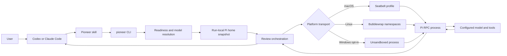

# Architecture

## Purpose and current scope

Pioneer is a local task-delegation bridge from coding agents to the operator's installed Pi coding agent. It currently supports code reviews and isolated skill-eval runs. It reuses Pi's configured providers, authentication, models, tools, and skills while placing the Pi process behind an operating-system boundary on macOS and Linux.

The current product surface is:

- a synchronous review CLI and TypeScript API;
- a fail-closed skill-eval preparation and execution CLI;
- native macOS Seatbelt and Linux Bubblewrap transports;
- one shared agent skill packaged for Codex and Claude Code.

Background jobs, cancellation APIs, structured finding schemas, MCP transport, and automated eval grading are not implemented. They are extension points, not current behavior.

## System view

The plugin contains instructions only. The CLI owns all policy, validation, Pi startup, sandboxing, and RPC behavior so the Codex and Claude integrations cannot drift.

## Module boundaries

| Area | Main modules | Responsibility |
| --- | --- | --- |
| CLI adapters | `src/review-cli.ts`, `src/eval-run-cli.ts` | Parse argv, print results, set exit status |
| Pi readiness | `src/pi-readiness.ts`, `src/pi-model-selection.ts` | Detect Pi, enumerate configured models, resolve exact requests |
| Pi preparation | `src/pi-home.ts`, `src/pi-startup.ts` | Copy the Pi agent directory and apply fast, ephemeral startup flags |
| Review orchestration | `src/review/runner.ts` | Validate, prepare, sandbox, run RPC, collect the final report, clean up |
| Review policy | `src/review/isolation.ts` | Canonicalize grants and prevent broad or overlapping writable access |
| Eval orchestration | `src/eval-run/setup.ts`, `src/eval-run/runner.ts` | Stage isolated eval arms, prove containment, run the actor |
| Eval policy | `src/eval-run/isolation.ts` | Reject unsafe runtime grants and define public-only networking |
| Native sandbox | `src/sandbox/launcher.ts` | Compile one policy into Seatbelt or Bubblewrap argv |
| Network mediation | `src/eval-run/public-egress-proxy.ts`, `src/sandbox/linux-proxy-bridge.ts` | Authenticate proxy use, resolve and pin destinations, bridge Linux namespaces |
| Public API | `src/index.ts` | Export the supported TypeScript surface |

Dependencies flow from adapters and orchestration toward validation and transport helpers. Plugin files do not duplicate policy.

## Review lifecycle

1. Validate the prompt, source directory, reference grants, write grants, and requested thinking level.
2. Refuse Windows unless the caller explicitly opts into unsandboxed review execution.
3. Run `pi --version`, enforce the supported range, and run `pi --offline --no-approve --list-models` before creating the review scratch area. Reject an invalid `models.json` rather than using Pi's partial catalog. Newer-than-tested Pi versions continue with a warning; older or malformed versions fail before model discovery. If Pi reports no models, use access-only filesystem probes to distinguish missing configuration from an outer agent sandbox that hides Pi's agent directory. Readiness uses an allowlisted runtime environment and does not inherit provider secrets or outer-agent control state.
4. Resolve a requested qualified model exactly, or an unqualified model only when it is unique.
5. Copy `PI_CODING_AGENT_DIR` (default `~/.pi/agent`) into a private writable run directory. Review copies include Pi skills; sessions, logs, caches, and symlinked agent-bin Pi launchers are excluded.
6. Build an ephemeral `pi --mode rpc` command with offline startup, no session, no approval, no prompt-template discovery, and no theme discovery.
7. Start an authenticated loopback proxy when networking is enabled.
8. Compile the native sandbox policy and start Pi without a shell, using a narrow actor environment on every platform.
9. Send one JSONL prompt request and collect bounded RPC events until `agent_settled`, failure, or timeout.
10. Return Pi's final Markdown report and remove the proxy, bridge, Pi snapshot, and scratch directory in `finally` cleanup.

See [REVIEW-TRANSPORT.md](REVIEW-TRANSPORT.md) for the RPC contract and [SECURITY.md](SECURITY.md) for the trust boundaries.

## Eval lifecycle

Eval preparation creates controller-only metadata plus independent `baseline` and `with-skill` actor directories. Only the with-skill arm receives a sanitized skill copy. Before every actor launch, the runner proves that the sandbox cannot read or modify an outside sentinel, inherit a host-only secret, or connect directly to a host loopback listener.

The eval runner is an isolation primitive. It does not schedule all cases, call a grader, compare scores, or publish a report. See [EVALS.md](EVALS.md).

## Extension points

- A job service can wrap `runReview` without changing review policy.
- MCP or richer client adapters can translate inputs and presentation while calling the same API.
- Structured findings can be introduced as a versioned result contract after Pi output validation is implemented.
- Additional sandbox backends must satisfy the same path, environment, network, and mandatory-probe invariants.
